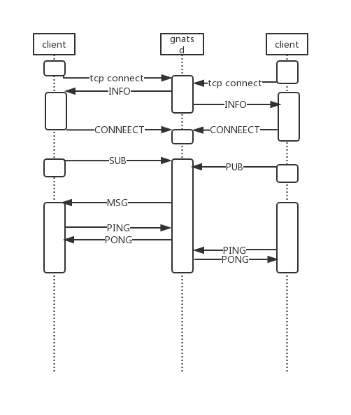

# NATS 开源学习——0X00：协议

> NATS源码学习系列文章基于[gnatsd1.0.0](https://github.com/nats-io/gnatsd/tree/v1.0.0)。该版本于2017年7月13
> 日发布（[Release v1.0.0](https://github.com/nats-io/gnatsd/releases/tag/v1.0.0)）,在此之前v0.9.6是2016年12月
> 16日发布的,中间隔了半年。算是一个比较完备的版本，但是这个版本还没有增加集群支持。为什么选择这个版本呢？
> 因为一来这个版本比较稳定，同时也包含了集群管理和[Stream](https://github.com/nats-io/nats-streaming-server)
> 落地相关的逻辑，相对完善。

## gnatsd
在好多年前写过一篇关于NATS的初体验[NATS之gnatcd初体验](./have_a_try_with_gnatcd.md)。
那个时候gnatsd才0.8.0。当时只是因为新看到一个听说性能很屌的MQ，于是就尝试了一下，一晃眼，gnatsd都发布了n多个版本了（1.4.x都出来了）
也成为了[CNCF](https://www.cncf.io/blog/2018/03/15/cncf-to-host-nats/)孵化项目之一。所以通过gnatsd的一个稳定版本来学习下
这个MQ的实现。

## Demo

在以前的文章[NATS之gnatcd初体验](./have_a_try_with_gnatcd.md)中其实已经给出了一个Demo。
因为这里主要聚焦于服务器测，也就是gnatsd的实现，所以主要需要是替换Demo中的服务器。

首先从1.0.0的tag处拉出来代码，或者直接下载1.0.0的代码，链接[gnatsd1.0.0](https://github.com/nats-io/gnatsd/tree/v1.0.0)。

这里可以选择在GOPATH里面"git clone "+ "git checkout "。也可以利用现在的 go mod 在一个自己想放的目录里面进行编译（GO1.11版本既以上）。
比如这里我们要用来分析源码，所以放到一个"learn_gnatsd_source"的目录下。然后执行：

	gnatsd-1.0.0 cz$ go mod init github.com/nats-io/gnatsd
	go: creating new go.mod: module github.com/nats-io/gnatsd
	go: copying requirements from vendor/manifest
	
然后执行编译：

	gnatsd-1.0.0 cz$ go build
	go: finding github.com/nats-io/nuid v1.0.0
	go: finding golang.org/x/sys v0.0.0-20170627012538-f7928cfef4d0
	go: finding golang.org/x/crypto v0.0.0-20161031180806-9477e0b78b9a
	go: downloading golang.org/x/crypto v0.0.0-20161031180806-9477e0b78b9a
	go: downloading github.com/nats-io/nuid v1.0.0
	go: extracting github.com/nats-io/nuid v1.0.0
	go: extracting golang.org/x/crypto v0.0.0-20161031180806-9477e0b78b9a	
这里就可以在当前目录下看到编译好的gnatsd文件了。直接运行不用配置文件可以默认监听4222端口。

	gnatsd-1.0.0 cz$ ./gnatsd
	[45939] 2019/03/19 15:40:37.908062 [INF] Starting nats-server version 1.0.0
	[45939] 2019/03/19 15:40:37.908385 [INF] Listening for client connections on 0.0.0.0:4222
	[45939] 2019/03/19 15:40:37.908395 [INF] Server is ready

然后就可以用go的或者其他语言的客户端来进行连接了。

## 协议
在逐一学习代码前，我们来看下NATS支持的各种协议以及各式。

NATS的协议是个纯文本协议，因此可以通过使用类似telnet的方式来进行和上面的gnats之间的交互。比如：

gnatsd-1.0.0 cz$ telnet localhost 4222
Trying ::1...
Connected to localhost.
Escape character is '^]'.
INFO {"server_id":"j2f6ynq4T2K5apG7A9hBud","version":"1.0.0","go":"go1.12","host":"0.0.0.0","port":4222,"auth_required":false,"ssl_required":false,"tls_required":false,"tls_verify":false,"max_payload":1048576}

可以看到，当客户端和服务器一连接的时候，服务器就会发一条INFO协议下来。

从上面也可以看到，NATS的协议大概是JSON格式（数据部分是byte数组)。基本格式为：

CMD \t payload \r\n

这里CMD可能是INFO/CONNECT/PUB/SUB等，"\t"写出来是表示那里有个空格，然后最后以"\r\n"来结束。所以本质上来说，NATS协议是和HTTP
类似的一种文本协议。

NATS和客户端交互的时序大概如图中。

1. 客户端建立到gnats的TCP链接
2. gnats向客户端发送INFO协议
3. 客户端需要向服务器回一个CONNECT协议
4. 然后根据需要，客户端订阅消息，发送SUB协议
5. 其他客户端在建立链接后，发布消息，发送PUB协议
6. 正常情况下，客户端和服务器间通过PING/PONG维护心跳

NATS就通过这样实现了一个订阅发布的系统。

### 1. INFO
INFO协议是客户端创建TCP连接后，服务器就会主动发送的协议。格式为：

	INFO {["option_name":option_value],...}
	
其中包含了

option_name|含义
---|---
server_id | NATS服务器的ID
version | gnats的版本
go | gnats用的go版本
host | 服务器主机IP 
port|服务器主机Port
max_payload| 最大接受长度
proto|协议版本号
client_id| 可选的表示客户标记的ID
auth_required | 是否需要鉴权
tls_required | 是否需要TLS
tls_verify| TLS需要的证书
connect_urls | 一个URL列表，表示客户端可以连接的服务器地址

如：

	INFO {"server_id":"j2f6ynq4T2K5apG7A9hBud","version":"1.0.0","go":"go1.12","host":"0.0.0.0","port":4222,"auth_required":false,"ssl_required":false,"tls_required":false,"tls_verify":false,"max_payload":1048576}\r\n

### 2. CONNECT

当客户端创建了TCP连接后，需要向服务器发送一个CONNECT协议，告诉服务器自己的信息。

格式：

	CONNECT {["option_name":option_value],...}
	
option_name|含义
---|---
verbose| 是否关闭服务器的+OK冗余信息，+OK见下面的说明
pedantic|是否打开严格校验 
tls_required|是否需要TLS 
auth_token|鉴权内容 
user| 用户名 
pass|密码 
name|客户端名称 
lang| 客户端的实现语言  
version| 客户端版本  
protocol|协议版本

如：

	[CONNECT {"verbose":false,"pedantic":false,"tls_required":false,"name":"","lang":"go","version":"1.2.2","protocol":1}]\r\n

### 3. PUB

发布消息使用PUB协议。

格式：

	PUB <subject> [reply-to] <#bytes>\r\n[payload]\r\n
	
字段|含义
---|---	
subject|订阅主题 The destination subject to publish to
reply-to|可选的是否指定接受响应者 The optional reply inbox subject that subscribers can use to send a response back to the publisher/requestor
#bytes| payload 大小
payload|具体数据

如：

	PUB FOO 11\r\nHello NATS!\r\n

### 4. SUB

订阅消息是使用SUB协议：

格式：

	SUB <subject> [queue group] <sid>\r\n
	
字段|含义
---|---	
subject| 订阅主题
queue group|可选的订阅组名
sid|客户端生成的唯一订阅ID

如：

	SUB BAR G1 44\r\n
	
### 5. UNSUB
取消订阅使用：UNSUB协议

格式：

UNSUB <sid> [max_msgs]

字段|含义
---|---
sid: 客户端生成的统一的订阅ID
max_msgs: 取消订阅前最多接受的消息数

如：
	UNSUB 1 5\r\n

### 6. MSG

订阅消息，通过MSG协议进行推送

格式：

	MSG <subject> <sid> [reply-to] <#bytes>\r\n[payload]\r\n

字段|含义
---|---	
subject| 订阅主题
sid| 主题的统一ID
reply-to| 该主题指定的响应者
#bytes|数据部分的大小
payload|真实的数据内容

### 7. PING/PONG
心跳维护协议，Ping/Pong就和ping协议一样，主要用来维护链接。

格式：

	PING\r\n

	PONG\r\n

### 9. +OK
如果客户端在CONNECT协议中国打开了verbose，那么服务器在收到相关消息后，会进行一个回执发送，就是通过"+OK"来表示接受到了，且可以正确处理。

格式：

	+OK

### 10. -ERR
如果某个客户端操作失败，比如发布消息的主题格式不符合（太长），就会给客户端返回一个错误消息。

格式：

	-ERR <error message>
	
错误内容在"error message"中信息说明。	

## 总结
NATS定义了一套非常简单的协议，来实现一个基于TCP链接的发布订阅系统。其核心就是订阅与发布，为此使用Golang实现了这套协议转发功能的gnatsd服务。这里
是说得益于Golang呢？还是说项目方写程序能力厉害呢？还是服务器设计的厉害呢？反正项目方原先是有一个Ruby的实现，现在抛弃了，现在官方主要维护的是这个
Golang版本的gnatsd。
