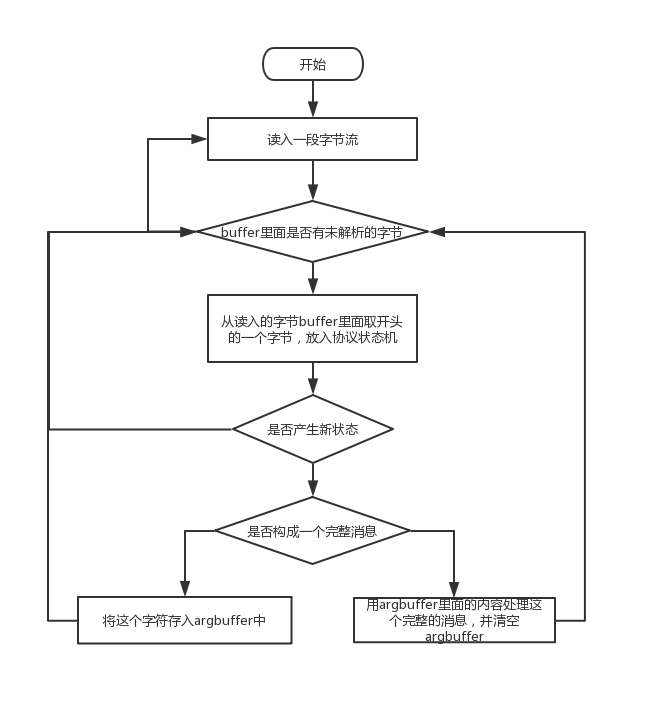
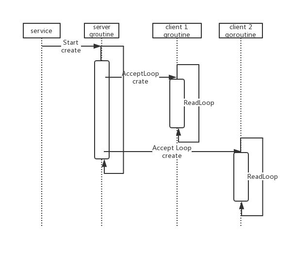

# NATS 开源学习——0X03：Client服务

> NATS源码学习系列文章基于[gnatsd1.0.0](https://github.com/nats-io/gnatsd/tree/v1.0.0)。该版本于2017年7月13
> 日发布（[Release v1.0.0](https://github.com/nats-io/gnatsd/releases/tag/v1.0.0)）,在此之前v0.9.6是2016年12月
> 16日发布的,中间隔了半年。算是一个比较完备的版本，但是这个版本还没有增加集群支持。为什么选择这个版本呢？
> 因为一来这个版本比较稳定，同时也包含了集群管理和[Stream](https://github.com/nats-io/nats-streaming-server)
> 落地相关的逻辑，相对完善。

在前面的文章[NATS 开源学习——0X02：Server构造](./gnatsd_source_02.md)中说到，Server在接受到一个客户端的TCP
连接后，创建一个Client对象。Client对象是承载单个客户端连接逻辑的对象。Client会开启一个readloop，读消息，然后处理消息

## readloop
readloop的逻辑大概是：

	 257 func (c *client) readLoop() {
	 ...
	 276     for {
	 277         n, err := nc.Read(b)
	 ...
	 289
	 290         if err := c.parse(b[:n]); err != nil {
	 ...
	 298         }  
					}
	 ...				
 
这里，首先从连接中读取TCP流中的数据，然后调用client.parse 函数对读取到的内容做解析。这里解析其实也是包含了处理逻辑。

client.parse函数的定义在"server/parse.go" 文件中，在后面协议解析部分的文章我们在详细说明。这里只要知道，parse里面会对
这个读取到的buffer做解析并做相关处理。

这里可能会问到，如果一次Read没有读取完整的消息会怎么办呢？这时看下client的定义：

	  87 type client struct {
	  ...
	 111     parseState
	  ...
	 118 }

	 17 type parseState struct {
	 18     state   int
	 19     as      int
	 20     drop    int
	 21     pa      pubArg
	 22     argBuf  []byte
	 23     msgBuf  []byte
	 24     scratch [MAX_CONTROL_LINE_SIZE]byte
	 25 }	 

这里client继承了协议解析状态机状态"parseState"。因此可以将这里的readloop想象成一个对流处理的处理器：

逐个字节的处理，每读入一个自己，根据当前的协议状态判断下一步如何处理，继续读取下一个字节解析还是已经完成读入一个完整的message，进行
消息的处理。

## Flush
在gnatsd的1.4.x中 除了上面的readLoop之外
是还有writeLoop的，用来将要发送给客户端的数据写到网络IO，就是读IO有个groutine,写IO也有个groutine。
但是在我们看的这个版本的gnatsd中，服务一个客户端连接的只有一个groutine(参考[NATS 开源学习——0X02：Server构造](./gnatsd_source_02.md)中的时序图）

把读消息，处理消息，写消息都融合在了readLoop里面。在上面的readloop里面有：

	 307         for cp := range c.pcd {
	 308             // Flush those in the set
	 310             if cp.nc != nil {
	 ...
	 
	 316                 cp.nc.SetWriteDeadline(time.Now().Add(opts.WriteDeadline))
	 317                 err := cp.bw.Flush()
	 318                 cp.nc.SetWriteDeadline(time.Time{})
	 319                 if err != nil {
	 ...
	 					
	 324                 } else {
	 325                     // Update outbound last activity.
	 326                     cp.last = last
	 327                     // Check if we should tune the buffer.
	 328                     sz := cp.bw.Available()
	 329                     // Check for expansion opportunity.
	 330                     if wfc > 2 && sz <= maxBufSize/2 {
	 331                         cp.bw = bufio.NewWriterSize(cp.nc, sz*2)
	 332                     }
	 333                     // Check for shrinking opportunity.
	 334                     if wfc == 0 && sz >= minBufSize*2 {
	 335                         cp.bw = bufio.NewWriterSize(cp.nc, sz/2)
	 336                     }
	 337                 }
	 338             }
	 339             cp.mu.Unlock()
	 340             delete(c.pcd, cp)
	 341         } 
 
 在处理发布消息的时候，就会调用 client.deliverMsg将其他的client挂在这个c.pcd里面：
 
		  87 type client struct {
		  ...
		 104     pcd   map[*client]struct{}
		 ...
		 }

然后在每次loop里面，会将要处理的订阅消息发送给这里挂的其他订阅了的客户端。

关于订阅处理，会在后面的[NATS 开源学习——0X06：发布消息](./gnatsd_source_06.md)中介绍。这里介绍的是client是如何处理消息的接受、处理和发送。

## 总结
通过readloop，Client完成了消息的读取、解析、处理和发送。一个client就是一个goroutine。多个client之间互不影响，无需异步IO操作，逻辑容易理解。
这也就是groutine带来的高效和高性能吧。
