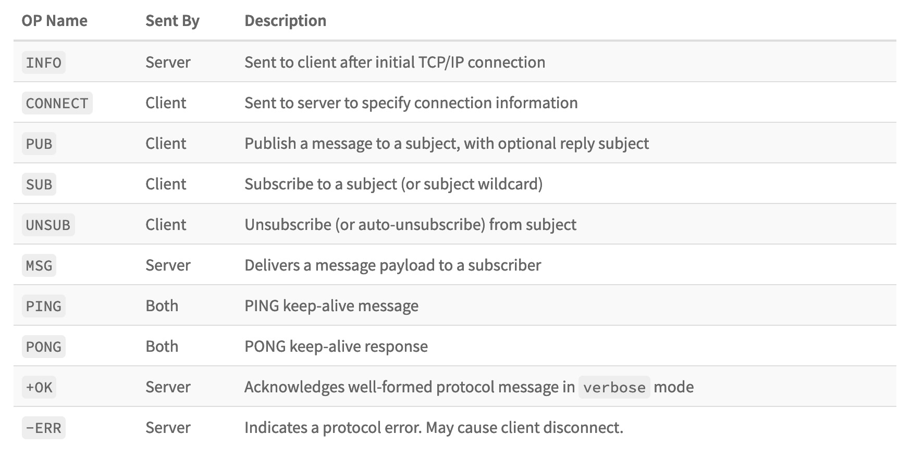

# NATS 开源学习——0X05：订阅消息

> NATS源码学习系列文章基于[gnatsd1.0.0](https://github.com/nats-io/gnatsd/tree/v1.0.0)。该版本于2017年7月13
> 日发布（[Release v1.0.0](https://github.com/nats-io/gnatsd/releases/tag/v1.0.0)）,在此之前v0.9.6是2016年12月
> 16日发布的,中间隔了半年。算是一个比较完备的版本，但是这个版本还没有增加集群支持。为什么选择这个版本呢？
> 因为一来这个版本比较稳定，同时也包含了集群管理和[Stream](https://github.com/nats-io/nats-streaming-server)
> 落地相关的逻辑，相对完善。

NATS总共有10条协议：

在[NATS 开源学习——0X04：协议解析](./gnatsd_source_04.md)中已经介绍了其中的6个，但是这些还不是最主要的逻辑，属于边角料。既然是MQ，最重要的当然是SUB/PUB了，这里我们先来看
订阅协议。

## SUB协议解析
一条SUB协议大概是这样的：

	SUB <subject> [queue group] <sid>\r\n
	
首先是SUB关键字，然后跟在后面是订阅的主题以及一个可选订阅组，再后面是客户端生成的订阅ID,最后换行结束。

在读取消息的时候，根据[NATS 开源学习——0X04：协议解析](./gnatsd_source_04.md)的介绍，先解析出SUB关键字，然后开始处理参数。这次参数不再是JSON格式，所以需要
根据自定义的协议进行解析：

	 750 func (c *client) processSub(argo []byte) (err error) {
	 751     c.traceInOp("SUB", argo)
	 752
	 753     // Indicate activity.
	 754     c.cache.subs += 1
	 755
	 756     // Copy so we do not reference a potentially large buffer
	 757     arg := make([]byte, len(argo))
	 758     copy(arg, argo)
	 759     args := splitArg(arg)
	
调用splitArg进行解析，其实就是将上面的格式，按照空格进行分割，得到上面说的几个部分。相关代码可以再`splitArg`的定义中找到，不在列出，
这里其实是可以用strings.Split进行替换的，没必要自己去实现一个，只是需要注意下'\r','\n'。

同时这里因为订阅组是可选的内容，所以

	 762     case 2:
	 763         sub.subject = args[0]
	 764         sub.queue = nil
	 765         sub.sid = args[1]
	 766     case 3:
	 767         sub.subject = args[0]
	 768         sub.queue = args[1]
	 769         sub.sid = args[2]
	 
如果没有则设置为nil。	 

## 订阅权限

在客户端连接的时候会先注册其订阅权限，processConnect里面有

	 470         // Check for Auth
	 471         if ok := srv.checkAuthorization(c); !ok {
	 472             c.authViolation()
	 473             return ErrAuthorization
	 474         }
 
 这里会调用:
 
	 82 // checkAuthorization will check authorization based on client type and
	 83 // return boolean indicating if client is authorized.
	 84 func (s *Server) checkAuthorization(c *client) bool {
	 85     switch c.typ {
	 86     case CLIENT:
	 87         return s.isClientAuthorized(c)
 
 然后会注册这个客户端到订阅的列表中：
 
	  95 // isClientAuthorized will check the client against the proper authorization method and data.
	 96 // This could be token or username/password based.
	 97 func (s *Server) isClientAuthorized(c *client) bool {
	 98     // Snapshot server options.
	 99     opts := s.getOpts()
	100
	101     // Check multiple users first, then token, then single user/pass.
	102     if s.users != nil {
	103         user, ok := s.users[c.opts.Username]
	104         if !ok {
	105             return false
	106         }
	107         ok = comparePasswords(user.Password, c.opts.Password)
	108         // If we are authorized, register the user which will properly setup any permissions
	109         // for pub/sub authorizations.
	110         if ok {
	111             c.RegisterUser(user)
 
 插入过程会先构建一个subscription对象：
 
	 222 // RegisterUser allows auth to call back into a new client
	 223 // with the authenticated user. This is used to map any permissions
	 224 // into the client.
	 225 func (c *client) RegisterUser(user *User) {
	 
	 ...
	 243
	 244     // Loop over publish permissions
	 245     for _, pubSubject := range user.Permissions.Publish {
	 246         sub := &subscription{subject: []byte(pubSubject)}
	 247         c.perms.pub.Insert(sub)
	 248     }
	 249
	 250     // Loop over subscribe permissions
	 251     for _, subSubject := range user.Permissions.Subscribe {
	 252         sub := &subscription{subject: []byte(subSubject)}
	 253         c.perms.sub.Insert(sub)
	 254     }
 
其中permission的定义为： 
 
	 120 type permissions struct {
	 121     sub    *Sublist
	 122     pub    *Sublist
	 123     pcache map[string]bool
	 124 }

实际上就是一个保持了订阅主题和发布主题的列表。 

然后在订阅处理中检查权限，判断客户端是否可以进行订阅操作：

	 782     // Check permissions if applicable.
	 783     if !c.canSubscribe(sub.subject) {
	 784         c.mu.Unlock()
	 785         c.sendErr(fmt.Sprintf("Permissions Violation for Subscription to %q", sub.subject))
	 786         c.Errorf("Subscription Violation - User %q, Subject %q, SID %s",
	 787             c.opts.Username, sub.subject, sub.sid)
	 788         return nil
	 789     }

”c.canSubscribe“就是检查上面的permissions的允许列表。

## 订阅处理

在解析了参数后会创建一个subscription订阅对象：

 	760     sub := &subscription{client: c}		

然后对router转发做一个过滤，比如两个router转发了同一个客户端的请求，此时订阅ID是相同的：

	 791     // We can have two SUB protocols coming from a route due to some
	 792     // race conditions. We should make sure that we process only one.
	 793     sid := string(sub.sid)
	 794     if c.subs[sid] == nil {
	 795         c.subs[sid] = sub
 
只对第一个进行处理，并将其存入client里面的保存这个客户端订阅的字典中：

	 87 type client struct {
	 101     subs  map[string]*subscription
 
接着会将这个subscription插入一个订阅到列表中：
	 
	 797             err = c.srv.sl.Insert(sub)
	 798             if err != nil {
	 799                 delete(c.subs, sid)
	 800             } else {
	 801                 shouldForward = c.typ != ROUTER
	 802             }
	 
关于插入的逻辑和内部存储的数据结构，在后面的[NATS 开源学习——0X06：消息存储结构](./gnatsd_source_06.md)中会详细说明	 

## UNSUB取消订阅

而如果要取消订阅则使用UNSUB协议：

	UNSUB <sid> [max_msgs]
	
这里 sid为之前订阅的时传入的主题ID，而max_msgs为可选的参数，表示退订前最大可接受的消息条数。

和前面解析SUB时一样，这里也是先解析出UNSUB命令字，然后对其后面的参数进行解析，这里也不是JSON，而是空格分割的两个参数：

	 844 func (c *client) processUnsub(arg []byte) error {
	 845     c.traceInOp("UNSUB", arg)
	 846     args := splitArg(arg)
	 847     var sid []byte
	 848     max := -1
	 849
	 850     switch len(args) {
	 851     case 1:
	 852         sid = args[0]
	 853     case 2:
	 854         sid = args[0]
	 855         max = parseSize(args[1])
	 856     default:
	 857         return fmt.Errorf("processUnsub Parse Error: '%s'", arg)
	 858     }
	 
因为	 max是个可选的参数，所以根据分割参数后的数目来进行决定赋值。

然后根据这里的sid找到当时订阅产生的subscription，并执行c.unsubscribe操作：

	 870     if sub, ok = c.subs[string(sid)]; ok {
	 871         if max > 0 {
	 872             sub.max = int64(max)
	 873         } else {
	 874             // Clear it here to override
	 875             sub.max = 0
	 876         }
	 877         unsub = true
	 878         shouldForward = c.typ != ROUTER && c.srv != nil
	 879     }
	 880     c.mu.Unlock()
	 881
	 882     if unsub {
	 883         c.unsubscribe(sub)
	 884     }		 

而unsubscribe的逻辑主要是	:

	 828 func (c *client) unsubscribe(sub *subscription) {
	 ...
	 838     delete(c.subs, string(sub.sid))
	 839     if c.srv != nil {
	 840         c.srv.sl.Remove(sub)
	 841     }
	 842 }
删除SUB时插入到client.subs字典里面的subscription，并从SubList中删除这个subscription。
关于删除的逻辑和内部存储的数据结构，在后面的[NATS 开源学习——0X06：消息存储结构](./gnatsd_source_06.md)中会详细说明

## 总结
订阅消息的过程，首先是解析订阅协议，并产生一个subscription，让然后将其记录并存入到订阅列表中，而取消订阅则是相反的操作，分别从
client的记录和订阅列表中删除这个subscription。在订阅之前还会进行权限检查，以支持权限系统。
 
	

 
 
 

 	 

	 
	 

